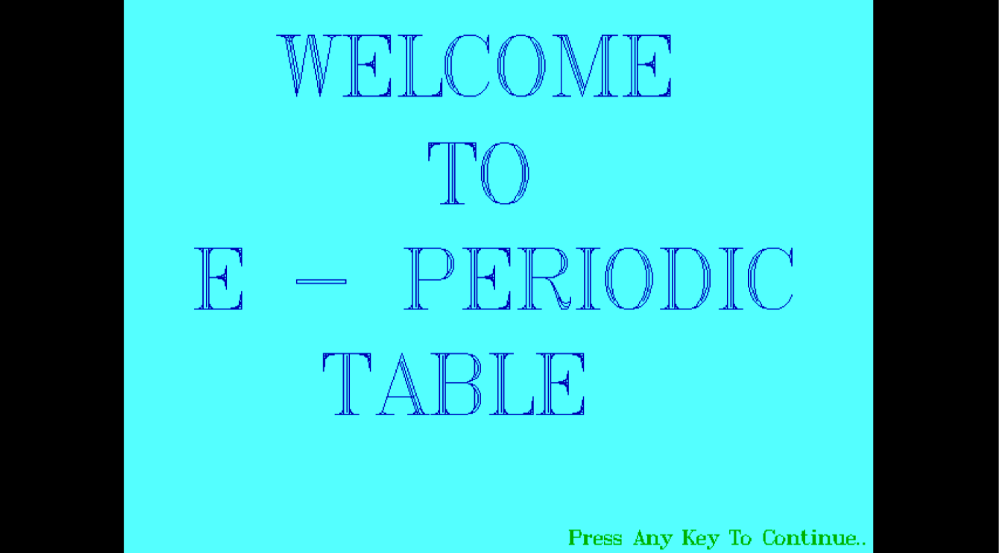
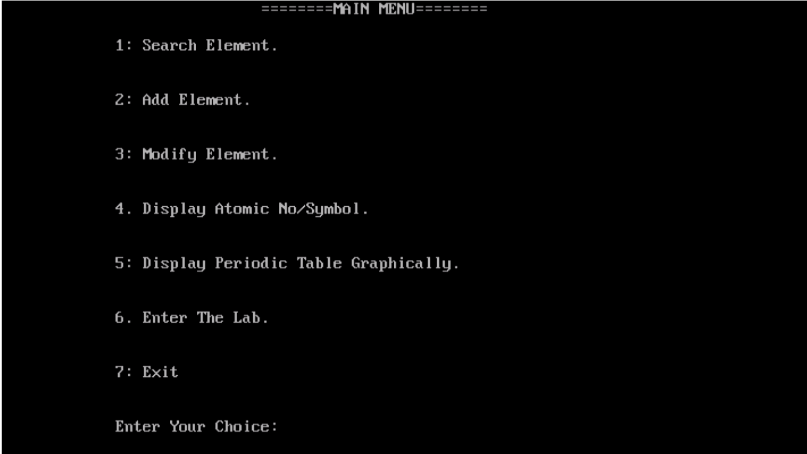
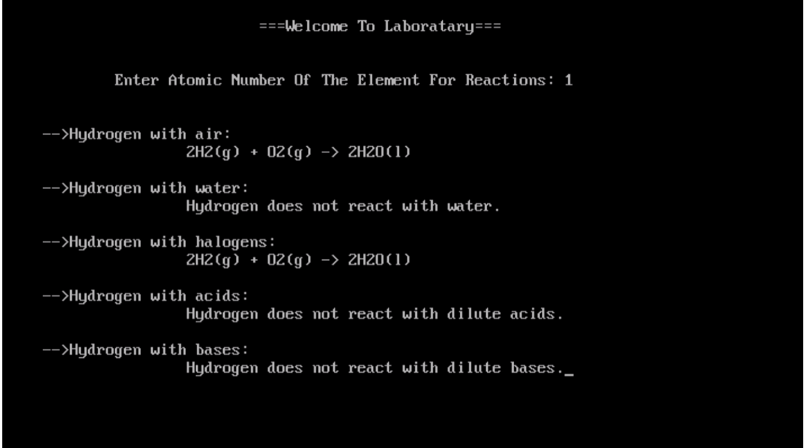

# E-Periodic-Table
This project is all about getting information and graphical representation of Modern Periodic Table which is developed in C++ using file and graphics. “E-Periodic Table” is a platform for chemistry students that can have useful information on any element from the table and can examine its characteristics. The graphical representation module makes it more handy and attracting, in which a student or user can see the whole modern periodic table visually and can even know about the Metals, Non-Metals, &amp; Metalloids. Adding of information and editing any can be done by administration which is password protected for security purpose. Further extension to this project is “The Lab”, this module is all about the elements taking part in various useful reactions of day-to-day life for a chemistry student. This project contains a game called “Bouncing Ball”. The purpose of developing this system is to make a fun game. The game has a paddle which can be moved using mouse or keyboard. There will be three balls at the beginning of the game. The game ends when you lose all three balls. The score is displayed on the top right corner and the final score will be displayed at the end of game. User can restart the game by clicking the mouse or pressing enter.

# Screenshots

.png)

